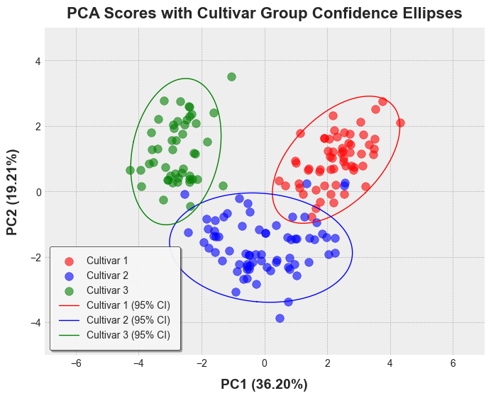

# pyEllipse

A Python package for computing Hotelling's T² statistics and generating confidence ellipse/ellipsoid coordinates for multivariate data analysis and visualization.

## Overview

`pyEllipse` provides three main functions for analyzing multivariate data:

1. __`hotelling_parameters`__ - Calculate Hotelling's T² statistics and ellipse parameters
2. __`hotelling_coordinates`__ - Generate Hotelling's ellipse/ellipsoid coordinates from PCA/PLS scores
3. __`confidence_ellipse`__ - Compute confidence ellipse/ellipsoid coordinates from raw data with grouping support

## Installation

```bash
pip install numpy pandas scipy scikit-learn matplotlib
```

Then install the package:

```bash
pip install pyEllipse
```

## Functions

### 1. `hotelling_parameters` - Hotelling's T² Statistics

Calculate Hotelling's T² statistic and ellipse parameters from component scores (PCA, PLS, ICA, etc.).

**Key Features:**

- Computes T² statistic for outlier detection
- Provides 95% and 99% confidence cutoffs
- Calculates ellipse semi-axes for 2D plots
- Supports automatic component selection via variance threshold

**Parameters:**

- `x`: Matrix/DataFrame of component scores
- `k`: Number of components (default: 2)
- `pcx`, `pcy`: Components for x/y axes (default: 1, 2)
- `threshold`: Cumulative variance threshold for automatic component selection
- `rel_tol`, `abs_tol`: Variance thresholds for component filtering

**Returns:**

- `Tsquared`: DataFrame with T² values for each observation
- `cutoff_99pct`, `cutoff_95pct`: Confidence cutoffs
- `Ellipse`: Semi-axes lengths (when k=2)
- `nb_comp`: Number of components used

### 2. `hotelling_coordinates` - Hotelling's Ellipse Coordinates

Generate coordinate points for drawing Hotelling's T² ellipses/ellipsoids from component scores.

**Key Features:**

- Creates smooth ellipse boundaries for plotting
- Supports both 2D ellipses and 3D ellipsoids
- Uses Hotelling's T² distribution for confidence regions
- Customizable number of points for smooth curves

**Parameters:**

- `x`: Matrix/DataFrame of component scores
- `pcx`, `pcy`, `pcz`: Component indices for axes
- `conf_limit`: Confidence level (default: 0.95)
- `pts`: Number of points to generate (default: 200)

**Returns:**

- DataFrame with 'x', 'y' columns (2D) or 'x', 'y', 'z' columns (3D)

### 3. `confidence_ellipse` - Confidence Ellipse from Raw Data

Compute confidence ellipse/ellipsoid coordinates directly from raw data with support for grouping.

**Key Features:**

- Works with raw data (not component scores)
- Supports grouping by categorical variables
- Choice of 'normal' (chi-square) or 'hotelling' (T²) distributions
- Optional robust estimation for outlier resistance
- Unified API for 2D and 3D (via optional `z` parameter)

**Parameters:**

- `data`: DataFrame containing variables
- `x`, `y`, `z`: Column names for axes (z is optional)
- `group_by`: Column name for grouping
- `conf_level`: Confidence level (default: 0.95)
- `robust`: Use robust estimation (default: False)
- `distribution`: 'normal' or 'hotelling' (default: 'normal')

**Returns:**

- DataFrame with coordinate points and optional grouping column

## Usage Examples

### Example 1: Hotelling's T² statistic and confidence ellipse from PCA Scores

```python
import numpy as np
import pandas as pd
import matplotlib.pyplot as plt
plt.style.use('bmh')
from mpl_toolkits.mplot3d import Axes3D
from sklearn.decomposition import PCA
from pathlib import Path
from pyEllipse import hotelling_parameters, hotelling_coordinates, confidence_ellipse
```

```python
img_dir = Path("images")
img_dir.mkdir(exist_ok=True)
plt.style.use('seaborn-v0_8-darkgrid') 
```

```python
def load_wine_data():
    """Load wine dataset and add cultivar labels"""
    wine_df = pd.read_csv('data/wine.csv')
    
    # Add cultivar labels based on standard Wine dataset structure
    cultivar = []
    for i in range(len(wine_df)):
        if i < 59:
            cultivar.append('Cultivar 1')
        elif i < 130:
            cultivar.append('Cultivar 2')
        else:
            cultivar.append('Cultivar 3')
    
    wine_df['Cultivar'] = cultivar
    return wine_df
```

```python
wine_df = load_wine_data()
X = wine_df.drop('Cultivar', axis=1)
y = wine_df['Cultivar']

# Perform PCA
pca = PCA()
pca_scores = pca.fit_transform(X)
```

```python
# Calculate T² statistics
results = hotelling_parameters(pca_scores, k=2)
t2 = results['Tsquared'].values

# Generate ellipse coordinates for plotting
ellipse_95 = hotelling_coordinates(pca_scores, pcx=1, pcy=2, conf_limit=0.95)
ellipse_99 = hotelling_coordinates(pca_scores, pcx=1, pcy=2, conf_limit=0.99)

# Plotting
plt.figure(figsize=(10, 8))
scatter = plt.scatter(pca_scores[:, 0], pca_scores[:, 1], c=t2, cmap='jet', alpha=0.85, s=70, label='Wine samples')
cbar = plt.colorbar(scatter)
cbar.set_label('Hotelling T² Statistic', rotation=270, labelpad=20)

plt.plot(ellipse_95['x'], ellipse_95['y'], 'r-', linewidth=1, label='95% Confidence level')
plt.plot(ellipse_99['x'], ellipse_99['y'], 'k-', linewidth=1, label='99% Confidence level')
plt.xlim(-1000, 1000)
plt.ylim(-50, 60)
plt.xlabel('PC1', fontsize=14, labelpad=10, fontweight='bold')
plt.ylabel('PC2', fontsize=14, labelpad=10, fontweight='bold')
plt.title("Hotelling's T² Ellipse from PCA Scores", fontsize=16, pad=10, fontweight='bold')
plt.legend(loc='upper left', fontsize=10, frameon=True, framealpha=0.9, edgecolor='black', shadow=True, facecolor='white', borderpad=1)
plt.show()
```


### Example 2: Confidence Ellipse from Raw Data

```python
wine_df['PC1'] = pca_scores[:, 0]
wine_df['PC2'] = pca_scores[:, 1]

colors = ['red', 'blue', 'green']
cultivars = wine_df['Cultivar'].unique()
color_map = {cultivar: color for cultivar, color in zip(cultivars, colors)}
point_colors = wine_df['Cultivar'].map(color_map)

# Plotting PCA scores with confidence ellipses for each cultivar
plt.figure(figsize=(10, 8))

for i, cultivar in enumerate(cultivars):
    mask = wine_df['Cultivar'] == cultivar
    plt.scatter(wine_df.loc[mask, 'PC1'], wine_df.loc[mask, 'PC2'], c=colors[i], alpha=0.6, s=70, label=cultivar) # type: ignore

ellipse_coords = confidence_ellipse(
    data=wine_df,
    x='PC1',
    y='PC2',
    group_by='Cultivar',
    conf_level=0.95,
    robust=True,
    distribution='hotelling'
)

for i, cultivar in enumerate(cultivars):
    ellipse_data = ellipse_coords[ellipse_coords['Cultivar'] == cultivar]
    plt.plot(ellipse_data['x'], ellipse_data['y'], color=colors[i], linewidth=1, linestyle='-', label=f'{cultivar} (95% CI)')

plt.xlim(-1000, 1000)
plt.ylim(-50, 60)
plt.xlabel('PC1', fontsize=14, labelpad=10, fontweight='bold')
plt.ylabel('PC2', fontsize=14, labelpad=10, fontweight='bold')
plt.title("PCA Scores with Cultivar Group Confidence Ellipses", fontsize=16, pad=10, fontweight='bold')
plt.legend(loc='upper left', fontsize=10, frameon=True, framealpha=0.9, edgecolor='black', shadow=True, facecolor='white', borderpad=1)
plt.show()
```



### Example 3: 3D Ellipsoid Visualization

```python
import numpy as np
import pandas as pd
import matplotlib.pyplot as plt
from mpl_toolkits.mplot3d import Axes3D
from sklearn.decomposition import PCA
from pyEllipse import hotelling_coordinates

# Generate sample data
np.random.seed(42)
data = np.random.randn(100, 10)

# Perform PCA
pca = PCA(n_components=5)
pca_scores = pca.fit_transform(data)

# Generate 3D ellipsoid coordinates (fewer points for 3D)
ellipsoid = hotelling_coordinates(
    pca_scores, 
    pcx=1, 
    pcy=2, 
    pcz=3, 
    conf_limit=0.95,
    pts=40
)

# Plot
fig = plt.figure(figsize=(12, 10))
ax = fig.add_subplot(111, projection='3d')

# Plot data points
ax.scatter(pca_scores[:, 0], pca_scores[:, 1], pca_scores[:, 2],
           alpha=0.6, s=30, label='Samples')

# Plot ellipsoid surface
grid_size = 40
x_surf = np.array(ellipsoid['x']).reshape(grid_size, grid_size)
y_surf = np.array(ellipsoid['y']).reshape(grid_size, grid_size)
z_surf = np.array(ellipsoid['z']).reshape(grid_size, grid_size)

ax.plot_surface(x_surf, y_surf, z_surf,
                alpha=0.3, color='red', edgecolor='none')

ax.set_xlabel('PC1')
ax.set_ylabel('PC2')
ax.set_zlabel('PC3')
ax.set_title('3D Hotelling Ellipsoid (95% Confidence)')
plt.tight_layout()
plt.show()
```

## Key Differences Between Functions

| Feature | `hotelling_parameters` | `hotelling_coordinates` | `confidence_ellipse` |
|---------|----------------|-----------------|---------------------|
| __Input__ | Component scores | Component scores | Raw data |
| __Purpose__ | T² statistics | Plot coordinates | Plot coordinates |
| __Grouping__ | -- | -- | Yes |
| __Robust__ | -- | -- | Yes |
| __2D/3D__ | 2D only for ellipse params | Both | Both |
| __Distribution__ | Hotelling only | Hotelling only | Normal or Hotelling |
| __Use Case__ | Outlier detection, QC | Visualizing PCA | Exploratory data analysis |

## When to Use Each Function

### Use `hotelling_parameters` when:

- You need T² statistics for outlier detection
- You want confidence cutoff values
- You're performing quality control or process monitoring
- You need ellipse parameters (semi-axes lengths)

### Use `hotelling_coordinates` when:

- You have PCA/PLS component scores
- You want to visualize confidence regions on score plots
- You need precise control over which components to plot
- You're creating publication-quality figures from multivariate models

### Use `confidence_ellipse` when:

- You're working with raw data (not scores)
- You need to compare multiple groups
- You want robust estimation for outlier-resistant analysis
- You need flexibility in distribution choice (normal vs Hotelling)

## Dependencies

- `numpy` - Numerical computations
- `pandas` - Data manipulation
- `scipy` - Statistical functions
- `scikit-learn` - Robust covariance estimation (optional, for `robust=True`)
- `matplotlib` - Plotting (for examples)

## Statistical Background

### Hotelling's T² Distribution

Hotelling's T² statistic is the multivariate analog of the univariate Student's t-statistic. For sample size `n` and `p` dimensions:

```sh
T² = ((n - p) / (p(n - 1))) × MD²
```

where MD² is the squared Mahalanobis distance. The T² distribution accounts for uncertainty in estimating both the mean vector and covariance matrix from sample data, making it more appropriate than the chi-square distribution for small to moderate sample sizes.

### Distribution Choice

- **Normal (χ²)**: Assumes known population parameters. Appropriate for very large samples (n > 100).
- **Hotelling (T²/F)**: Accounts for parameter estimation uncertainty. Better for small samples (n < 100).

As sample size increases, the two distributions converge.

## References

1. Hotelling, H. (1931). The generalization of Student's ratio. *Annals of Mathematical Statistics*, 2(3), 360-378.
2. Brereton, R. G. (2016). Hotelling's T-squared distribution, its relationship to the F distribution and its use in multivariate space. *Journal of Chemometrics*, 30(1), 18-21.
3. Raymaekers, J., & Rousseeuw, P. J. (2019). Fast robust correlation for high dimensional data. *Technometrics*, 63(2), 184-198.
4. Jackson, J. E. (1991). *A User's Guide to Principal Components*. Wiley.

## License

MIT License

## Author

Christian L. Goueguel

## Contributing

Contributions are welcome! Please open an issue or submit a pull request on GitHub.
